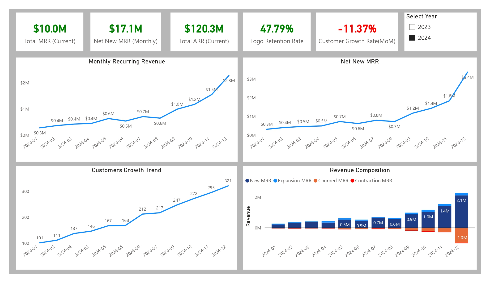
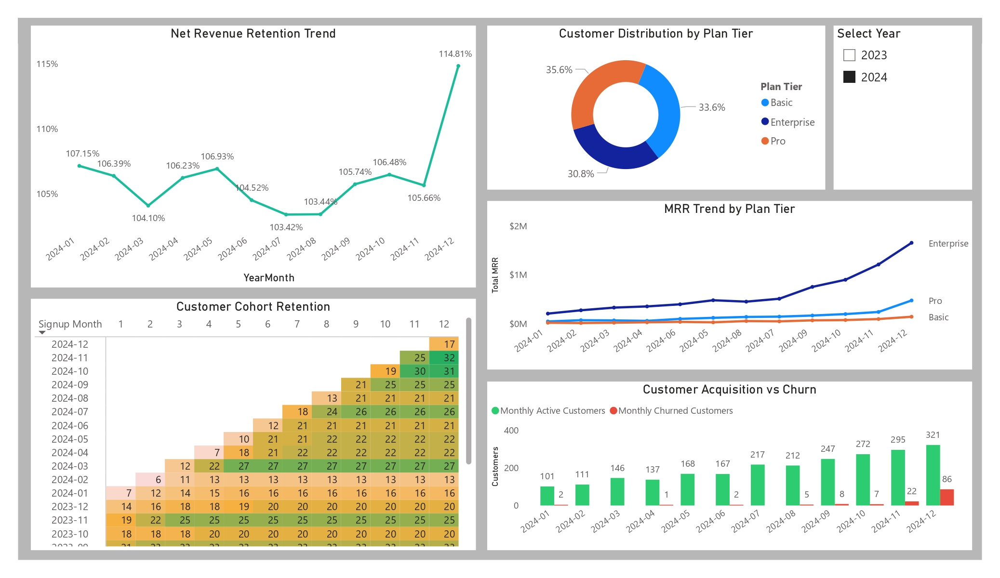
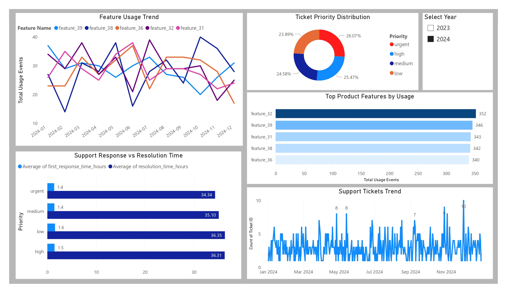

# SaaS Business Analytics Dashboard (Power BI)

## Dashboard Preview

### Executive Overview

### Revenue & Customer Analytics

### Page 3 – Product Usage & Support Analytics

This dashboard provides a comprehensive view of SaaS business performance, covering revenue growth, customer behavior, retention, and product engagement.

---

## Overview

This project analyze a SaaS business using multiple datasets including accounts, subscriptions, churn events, feature usage, and support tickets.

The dashboard is designed to help stakeholders understand business performance, identify growth opportunities, and monitor key SaaS metrics.

---

## Data Model

The data model integrates multiple tables:

- Accounts (customer details, signup, segmentation)  
- Subscriptions (MRR, ARR, lifecycle metrics)  
- Churn Events (customer churn and lifetime value)  
- Feature Usage (product engagement metrics)  
- Support Tickets (customer support performance)  
- Date Table (time intelligence)  

Relationships were designed to enable accurate filtering and time-based analysis.

---

## Key SaaS Metrics

- Monthly Recurring Revenue (MRR)  
- Annual Recurring Revenue (ARR)  
- Net New MRR  
- Customer Growth Rate  
- Logo Retention Rate  
- Net Revenue Retention  
- Churn Metrics (Customers & Revenue)  
- Cohort Retention  

---

## Dashboard Features

### Executive Overview
- KPI cards for revenue and growth  
- Revenue trends over time  
- Customer growth analysis  
- Revenue composition (MRR movement)  

### Revenue & Customer Analytics
- MRR trends by plan tier  
- Customer distribution by plan  
- Cohort retention matrix  
- Customer acquisition vs churn  
- Net revenue retention trend  

### Product & Support Analytics
- Feature usage trends  
- Top features by usage  
- Support ticket trends  
- Ticket priority distribution  
- Response vs resolution performance  

---

## Tools & Techniques

- Power BI  
- DAX (advanced measures for SaaS KPIs)  
- Data Modeling (multi-table relationships)  
- Time Intelligence  
- Cohort Analysis  

---

## Files Included

- Power BI file (.pbix)  
- Dashboard PDF (3 pages)  
- Dashboard images  

---

## Key Insights

- Revenue growth is primarily driven by expansion and new customer acquisition  
- Retention metrics highlight the importance of minimizing churn for sustainable growth  
- Cohort analysis reveals how customer retention evolves over time  
- Product usage patterns indicate which features drive engagement  
- Support performance impacts overall customer experience and retention  

---

## Business Impact

This dashboard enables decision-makers to:

- Track revenue performance and growth drivers  
- Monitor customer retention and churn behavior  
- Identify high-value customer segments  
- Improve product adoption and feature strategy  
- Optimize support operations and customer satisfaction  
